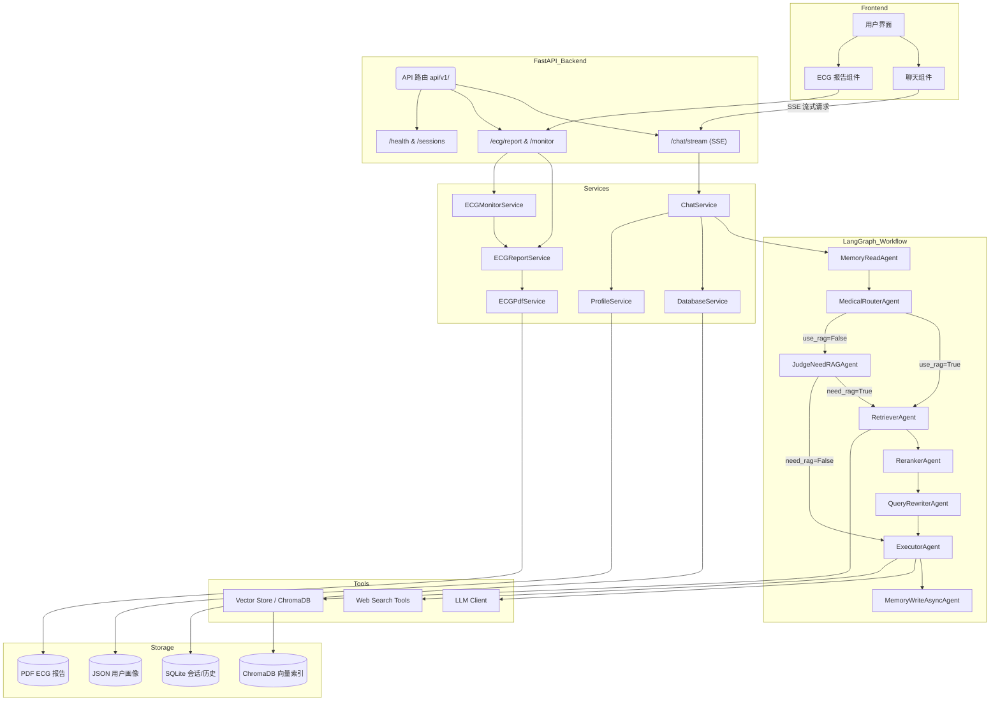

# 医枢智疗（HardWare-Medicial）

医枢智疗是一个面向真实医疗场景的多 Agent 智能系统，聚焦两条核心能力：

1. 多科室医疗问答（自动路由 + 手动科室锁定 + RAG）
2. ECG 数据抓取与专家报告生成（支持 PDF 输出）

系统目标是将“医疗问答 + 生理信号分析 + 长期记忆 + 可交付报告”整合为可持续迭代的医疗 AI 工作台。

## 核心特性

- 多科室路由：支持 7 个专业科室 + general
- 双路由模式：用户可手动锁定科室，或采用自动路由
- RAG 检索增强：科室级知识库检索，避免跨科室污染
- 真流式交互：前后端 SSE 流式返回
- ECG 闭环流程：前端引导信息填写 -> 抓取云端最新 ECG -> 生成报告
- ECG PDF：输出包含波形与文字结论的 PDF 报告
- 多用户隔离：按 `tenant_id + user_id + session_id` 隔离会话与画像
- `.env` 可控策略：联网搜索、QueryRewriter、模型协议均可配置

## 技术栈

- 前端：React + Vite
- 后端：FastAPI
- Agent 编排：LangGraph
- RAG：ChromaDB
- 存储：SQLite（会话）+ JSON（画像）+ 文件系统（PDF/向量库）

## 系统架构（简化）

```text
Frontend (React/Vite)
   │
   ├─ /api/v1/chat/stream (SSE)
   ├─ /api/v1/ecg/monitor/start
   └─ /api/v1/ecg/monitor/{task_id}
   │
FastAPI Backend
   │
   ├─ LangGraph Workflow
   │    MemoryRead
   │      -> HealthConcierge/Router
   │      -> QueryRewriter
   │      -> Retriever/Reranker
   │      -> Executor
   │      -> MemoryWriteAsync
   │
   ├─ RAG Vector Store (ChromaDB)
   ├─ Chat DB (SQLite)
   └─ ECG Report Service (PDF)
```

## 目录结构

```text
HardWare-Medicial/
├── backend/
│   ├── app/
│   │   ├── agents/
│   │   ├── api/v1/endpoints/
│   │   ├── core/
│   │   ├── schemas/
│   │   ├── services/
│   │   └── tools/
│   ├── data/knowledge/
│   ├── storage/
│   └── .env.example
├── frontend/
├── hardware/
├── docs/
├── run.py
└── README.md
```

## 项目结构流程图



## 快速开始

### 1) 环境准备

```bash
conda activate medigenius
```

### 2) 安装依赖

```bash
# backend
cd backend
pip install -r requirements.txt

# frontend
cd ../frontend
npm install
```

### 3) 配置环境变量

```bash
cp backend/.env.example backend/.env
```

至少配置以下变量：

- `OPENAI_BASE_URL`
- `OPENAI_API_KEY`
- `OPENAI_WIRE_API`（`chat` 或 `responses`）
- `LLM_MODEL`
- `LIGHT_LLM_MODEL`

可选配置：

- `RAG_ENABLED`
- `WEB_SEARCH_ENABLED`
- `WEB_SEARCH_USE_LLM_DECIDER`
- `QUERY_REWRITER_ENABLED`
- `QUERY_REWRITER_USE_LLM`
- `TAVILY_API_KEY`
- `ECG_SITE_URL` / `ECG_SITE_USER` / `ECG_SITE_PASS`

### 4) 一键启动

在仓库根目录执行：

```bash
python run.py
```

默认端口：

- 后端：`8000`
- 前端：`5173`（若占用会自动递增）

## 关键接口

- `GET /api/v1/health`
- `POST /api/v1/chat/stream`
- `GET /api/v1/sessions`
- `GET /api/v1/history`
- `POST /api/v1/new-chat`
- `POST /api/v1/ecg/report`
- `GET /api/v1/ecg/report/{report_id}`
- `GET /api/v1/ecg/report/{report_id}/pdf`
- `POST /api/v1/ecg/monitor/start`
- `GET /api/v1/ecg/monitor/{task_id}`

## ECG 使用说明（前端）

1. 登录系统
2. 点击 ECG 报告入口按钮
3. 填写姓名、年龄、性别等基础信息
4. 确认已上传云端 ECG 数据
5. 系统抓取最新一条数据并生成 PDF 报告

## 测试与构建

```bash
# backend tests
conda run -n medigenius pytest backend/tests -q

# frontend build
cd frontend && npm run build
```

## 致谢与来源

本项目的早期灵感与雏形来自：

- **MediGenius 原始项目（作者：Md. Emon Hasan）**  
  https://github.com/Md-Emon-Hasan/MediGenius

在此基础上，我们进行了较大幅度的二次开发与系统重构，当前版本主要改进包括：

1. 多科室路由体系（手动科室锁定 + 自动路由）与科室级 RAG 检索策略。  
2. 前后端 SSE 流式链路与更完整的 Agent 工作流拆分。  
3. ECG 全流程能力（前端引导 -> 云端抓取 -> 报告生成 -> PDF 交付）。  
4. 多用户隔离（tenant/user/session）与长期画像记忆机制。  
5. 中文化与重设计的前端交互界面，以及更多工程化配置与容错策略。  

## 创作者主页/项目地址

- ElonGe
  - GitHub: https://github.com/PacemakerG
- xhforever
  - GitHub: https://github.com/xhforever
- 项目地址
  - GitHub: https://github.com/xhforever/HardWare-Medicial


## 说明

- 本系统用于医疗辅助与科研演示，不替代执业医师诊断。
- 若出现急性高风险症状，请立即线下就医或呼叫急救。
